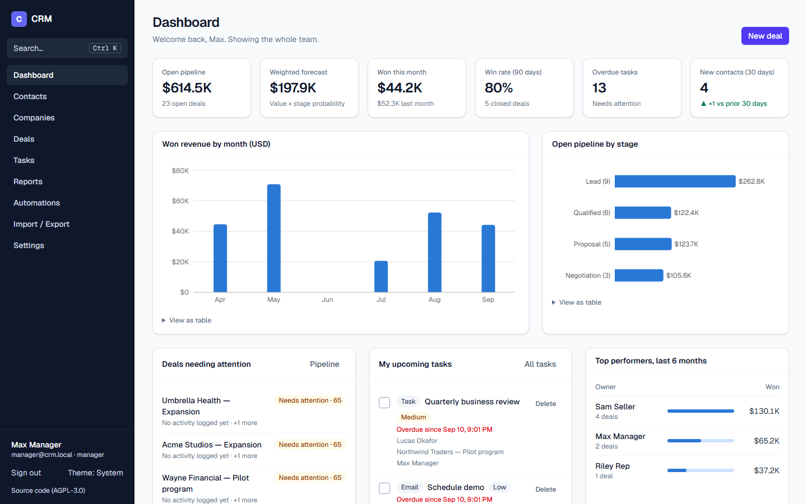
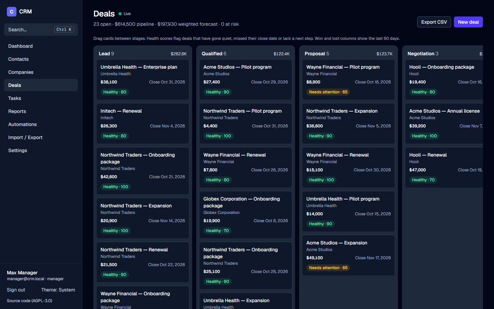
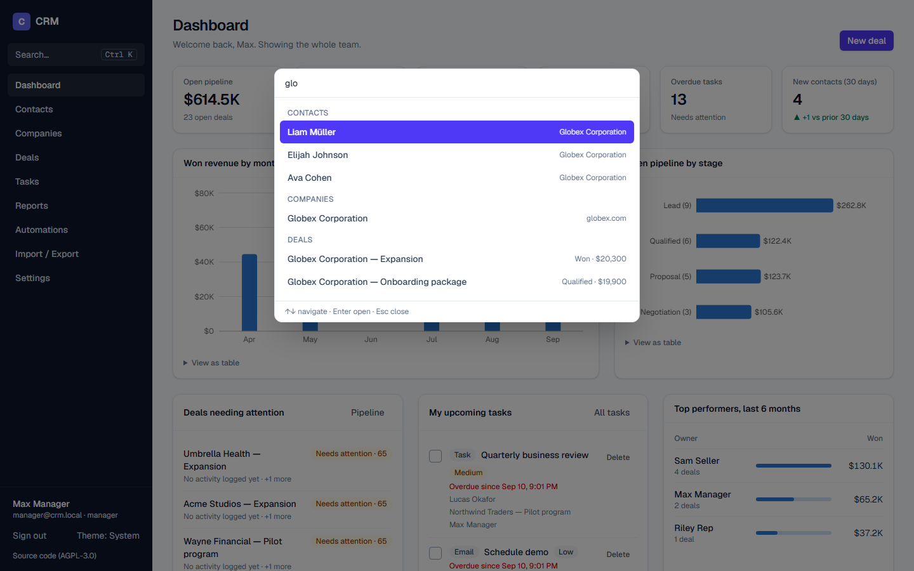
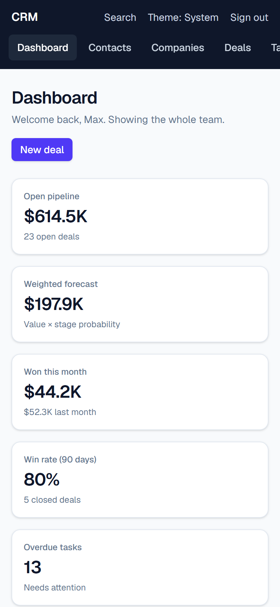

# CRM

[](https://github.com/ara-5/fullstack-crm/actions/workflows/ci.yml)
[](LICENSE)

A full-stack CRM built with Next.js 16 (App Router), Prisma/PostgreSQL, Auth.js and Tailwind CSS —
contacts, a drag-and-drop deal pipeline, tasks, automations, reporting, an AI assistant, a REST API
and signed webhooks, all behind role-based access control.

**[Live demo →](#)** _(add your deployed URL here)_ · admin@crm.local / manager@crm.local / rep@crm.local, password `Password123!`

<p align="center">
  
  
</p>
<p align="center">
  
  
</p>

## Features

- **Contacts & companies** — search, filters, pagination, tags, owners, an activity timeline and a
  field-level change history on every record.
- **Deal pipeline** — a drag-and-drop Kanban board (Lead → Qualified → Proposal → Negotiation →
  Won/Lost), stage probabilities, a weighted forecast, and an **explainable health score** on every
  open deal (flags deals that have gone quiet, missed their close date, or have no next step —
  with the specific reasons, not just a color).
- **AI assistant** _(optional)_ — one click on a deal summarizes its timeline, assesses risk, and
  drafts a follow-up email, powered by Claude (Opus 5) with structured output. Hidden entirely if
  no API key is configured.
- **Agentic AI command panel** _(optional)_ — a chat drawer that answers questions and takes
  actions ("what's overdue this week?", "draft a follow-up to Ada about the renewal") using tools
  scoped to the signed-in user's own permissions. Reads run immediately; every write (creating a
  task, moving a deal's stage, sending an email) is held as a proposal card the user must explicitly
  approve — the assistant can never do more than the user already could by hand.
- **Semantic search** _(optional)_ — contacts, companies and deals are embedded (Voyage AI) and
  searchable by meaning, not just keyword match; also gives the AI assistant real retrieval instead
  of hand-built prompts. Falls back to keyword search alone if unconfigured.
- **AI observability** — every AI call is logged (latency, tokens, status), visible to admins in
  Settings, so "is the assistant actually good" is a query, not a guess.
- **Durable background jobs** — webhook delivery and embedding computation run through a
  Postgres-backed job queue with retries and backoff, so a crash or redeploy mid-delivery doesn't
  silently drop work (see `npm run jobs:worker` / the `worker` compose service).
- **Tasks & activities** — tasks, calls, meetings, emails and notes, with due dates, priorities,
  and overdue/today/upcoming views.
- **Dashboard & reports** — KPI tiles, won revenue by month, pipeline by stage, a leaderboard,
  per-owner win rate and sales cycle, and lead-source conversion — all light/dark-mode aware charts
  built to WCAG-AA color contrast.
- **Command palette** (`Ctrl/⌘+K`) — fuzzy-jump to any page or record, or create a contact/company/
  deal/task, without leaving the keyboard.
- **Dark mode** — a real second theme (not an inverted filter), remembered per browser.
- **Auth & roles** — email/password login, rate-limited against brute force, with optional
  **two-factor authentication** (TOTP + one-time recovery codes — any authenticator app works).
  - **Admin** — everything, including users, webhooks and the audit log.
  - **Manager** — sees all records; manages automations, import/export and deletions.
  - **Rep** — sees and edits only their own records, everywhere (UI, API, exports).
- **Automations** — rules like *"when a deal moves to Won → create an onboarding task / email the
  contact / mark them as a customer"*, with conditions (stage, minimum value, contact status) and
  `{{placeholders}}`.
- **Audit trail** — every create/update/delete/stage-change is recorded with who, when, and a
  field-level diff, visible on the record and as a live feed for admins.
- **Notifications** — an in-app bell for assignments and deal outcomes, and a **presence
  indicator** ("Ada is also viewing this") on any record two people have open at once.
- **Saved views & bulk actions** — save a filtered contacts/companies list by name and reapply it
  in one click; select multiple records to bulk-tag, bulk-reassign or bulk-delete.
- **Import / export** — CSV import for contacts and companies (flexible header matching, per-row
  error report) and CSV export with formula-injection escaping.
- **REST API** — `/api/v1`, authenticated with per-user API keys (stored hashed, shown once), rate
  limited, and documented with a live **[interactive API reference](/api-docs)** generated from the
  same Zod schemas that validate requests.
- **Webhooks** — HMAC-SHA256 signed, retried with backoff, guarded against SSRF (targets must
  resolve to a public address), and auto-disabled after repeated failures.
- **Public demo mode** — one-click role logins, real email/webhook delivery disabled, data reset
  nightly by a cron job.

## Getting started

Requires Node.js 20.9+ and Docker (for local Postgres).

```bash
npm install
cp .env.example .env    # then set AUTH_SECRET: npx auth secret
npm run setup            # starts Postgres, applies migrations, seeds demo data
npm run dev
```

Open http://localhost:3000 and sign in. Every demo account's password is `Password123!`.

| Email | Role |
|---|---|
| admin@crm.local | Admin |
| manager@crm.local | Manager |
| rep@crm.local / sam@crm.local | Rep |

### All-in-Docker

No local Node.js needed — this builds and runs the whole stack (Postgres + migrations + seed + app):

```bash
docker compose --profile app up --build
```

### Scripts

| Command | What it does |
|---|---|
| `npm run dev` / `build` / `start` | Next.js dev server / production build / production server |
| `npm run lint` / `typecheck` | ESLint / `tsc --noEmit` |
| `npm test` / `test:watch` | Unit tests (Vitest) |
| `npm run test:e2e` / `test:e2e:ui` | End-to-end tests (Playwright), against a production build |
| `npm run screenshots` | Regenerates the screenshots in `docs/screenshots/` |
| `npm run db:migrate` | Create/apply a Prisma migration in development |
| `npm run db:seed` | Reset to fresh demo data |
| `npm run db:studio` | Browse the database |
| `npm run jobs:worker` | Continuously processes the background job queue (webhook delivery, embeddings) |

## Project structure

```
prisma/schema.prisma       data model (enum-like fields are strings, validated in code)
prisma/migrations/         SQL migration history
src/lib/demo-seed.ts       demo data (used by `prisma db seed` and the nightly demo reset)
src/proxy.ts               redirects signed-out visitors to /login (optimistic check only)
src/lib/env.ts             startup-validated environment variables (Zod)
src/lib/crm.ts             service layer: validation, record permissions, audit log, domain events
src/lib/automation.ts      event → automation rules → actions; webhooks delivered after the response
src/lib/deal-health.ts     pure, unit-tested deal health scoring
src/lib/reports.ts         dashboard & report queries
src/lib/permissions.ts     role rules and record scoping
src/lib/ssrf.ts            outbound-URL guard used by webhooks
src/lib/openapi.ts         OpenAPI 3.1 spec, generated from the Zod validation schemas
src/lib/totp.ts            pure, unit-tested TOTP + recovery codes (RFC 4226/6238, no dependency)
src/lib/two-factor.ts      2FA login verification (TOTP or a one-time recovery code)
src/lib/notifications.ts   in-app notifications (assignment, deal outcome, automation tasks)
src/lib/presence.ts        "who else is viewing this" heartbeat, backed by a short-TTL table
src/lib/saved-views.ts     named, reusable filters for the contacts/companies list pages
src/lib/jobs.ts            Postgres-backed job queue: enqueue, claim (SKIP LOCKED), retry/backoff
src/lib/embeddings.ts      pgvector semantic search + the "embed_record" job handler
src/lib/agent.ts           agentic AI command layer: tools, the tool-use loop, proposal approval
src/lib/ai-log.ts          AI call logging + usage aggregation (Settings → AI usage)
scripts/worker.ts          long-running job worker (self-hosted/Docker; Vercel uses a cron route instead)
src/app/(app)/…            authenticated pages (Server Components + Server Actions)
src/app/api/v1/…           REST API (API-key auth)
src/app/api/export/…       CSV export (session auth)
src/app/api-docs/          interactive API reference (Scalar, reads /api/v1/openapi.json)
e2e/                       Playwright end-to-end tests
```

UI actions, the REST API and CSV import all call the same functions in `src/lib/crm.ts`. That means
permissions, validation, the audit log, automations and webhooks behave identically everywhere.

## REST API

Create a key under **Settings → Your API keys**, then browse the
[interactive reference](/api-docs) or:

```bash
curl -H "Authorization: Bearer crm_…" "http://localhost:3000/api/v1/deals?stage=PROPOSAL"

curl -X PATCH -H "Authorization: Bearer crm_…" -H "Content-Type: application/json" \
  -d '{"stage":"WON"}' http://localhost:3000/api/v1/deals/<id>
```

| Resource | Endpoints |
|---|---|
| Contacts | `GET/POST /api/v1/contacts`, `GET/PATCH/DELETE /api/v1/contacts/:id` |
| Companies | `GET/POST /api/v1/companies`, `GET/PATCH/DELETE /api/v1/companies/:id` |
| Deals | `GET/POST /api/v1/deals`, `GET/PATCH/DELETE /api/v1/deals/:id` |
| Activities | `GET/POST /api/v1/activities`, `PATCH/DELETE /api/v1/activities/:id` |

A validation error returns `422` with details; the API is rate limited to 300 requests/minute per
key (see the `X-RateLimit-*` response headers). A key sees only the records its owner can see.

### Webhooks

Events: `contact.created`, `contact.updated`, `deal.created`, `deal.stage_changed`,
`activity.completed`. Deliveries are retried up to 3 times with backoff, and a webhook is paused
automatically after 10 consecutive failures. To verify a delivery, compute
`"sha256=" + HMAC_SHA256(secret, rawBody)` and compare it with the `X-CRM-Signature` header.

## Testing

```bash
npm test          # unit tests: validation, permissions, automation rules, deal health, SSRF guard,
                   # CSV, TOTP (verified against the RFC 6238 test vectors)
npm run build && npm run test:e2e   # end-to-end: auth incl. 2FA, RBAC, pipeline drag-and-drop,
                                     # automations, saved views, bulk actions, notifications,
                                     # presence, the REST API, the command palette, dark mode,
                                     # accessibility (axe)
```

CI (`.github/workflows/ci.yml`) runs lint, typecheck, both test suites and the build on every push
and pull request, against a real Postgres service container.

## AI assistant

Set `ANTHROPIC_API_KEY` to enable it — the "AI assistant" card on a deal calls Claude (Opus 5) with
structured output (Zod schema) to produce a summary, a risk level, next steps and a draft follow-up
email, cached on the deal and rate-limited per user. Without a key, the feature is simply hidden;
nothing else in the app depends on it.

## Moving to a different Postgres provider

Point `DATABASE_URL` (pooled) and `DIRECT_URL` (direct, for migrations) at your provider — e.g.
[Neon](https://neon.tech) or [Supabase](https://supabase.com) both work as-is — and run
`npx prisma migrate deploy`.

## Deploying (Vercel)

1. Import the repo, set `DATABASE_URL`/`DIRECT_URL` (a Neon/Supabase Postgres), `AUTH_SECRET`.
2. For a public demo: set `DEMO_MODE=true` and `CRON_SECRET` (a random string) — `vercel.json`
   schedules a nightly reset at `/api/cron/reset-demo`.
3. Optionally set `ANTHROPIC_API_KEY` and SMTP variables.

## Production notes

- Set a strong `AUTH_SECRET`; configure SMTP (`SMTP_HOST`, `SMTP_PORT`, `SMTP_USER`, `SMTP_PASS`,
  `EMAIL_FROM`) or emails are logged instead of sent.
- Money totals are summed only within the `CURRENCY` env var (default `USD`); deals in other
  currencies are counted but excluded from sums, never silently added together.
- Only admins can add webhook URLs; they're checked against private/internal address ranges at
  creation and before every delivery to prevent SSRF, but a fully trusted admin is still assumed.
- Automations run inline with the request; webhooks run after the response via `after()`. For high
  volume, move both to a job queue.
- See [SECURITY.md](SECURITY.md) for the full security model and how to report a vulnerability.

## Contributing

See [CONTRIBUTING.md](CONTRIBUTING.md).

## License

Copyright (C) 2026 Ara

This program is free software: you can redistribute it and/or modify it under the terms of the
GNU Affero General Public License as published by the Free Software Foundation, either version 3
of the License, or (at your option) any later version. See [LICENSE](LICENSE) for the full text.

In short: you may use, modify and self-host this CRM. If you run a modified version as a network
service (for example, a hosted SaaS), you must make your modified source code available to its
users under the same license.
